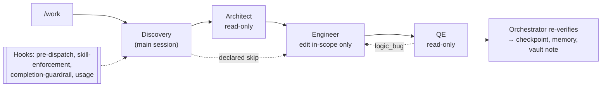

# Agentic Harness

A Claude Code–native agentic coding harness: a four-phase pipeline of specialized agents
(Discovery → Research → Implementation → Verification), each with deliberately restricted
permissions, coordinated by an orchestrator, guarded by hooks, and improved over time by a
memory loop. The core rule: no phase consumes the previous phase's output on trust. Every
artifact is schema-validated and every completion claim is independently re-verified before
it is believed.

## Status

**Complete and submitted.** Every component the assignment lists is implemented, and the
pipeline has been exercised end to end in live `/work` runs against `demo-repo/`.

- Test suite: **1616 passed, 2 skipped** (`python -m pytest -q`); `demo-repo` suite: 114 passed.
- Assignment audit: 71 PROVEN, 5 PARTIAL, 0 MISSING, 3 N/A; acceptance criteria 11 PROVEN,
  1 PARTIAL. The one partial acceptance criterion (AC-1) is pulling a real Jira ticket: ticket
  mode is implemented and tested, but no Jira credentials were available.

Key documents:

| Document | Contents |
|---|---|
| [`docs/final-writeup.md`](./docs/final-writeup.md) | Architecture, MCP vs REST decision, a surprising agent behavior, what was deleted |
| [`docs/assignment-audit.md`](./docs/assignment-audit.md) | Authoritative requirement-by-requirement status with evidence |
| [`docs/architecture.md`](./docs/architecture.md) | Full architecture diagram and legend |
| [`ASSIGNMENT.md`](./ASSIGNMENT.md) | The external requirements |
| [`PROJECT_SPEC.md`](./PROJECT_SPEC.md) | Internal specification and build log |

## Architecture

| Phase | Who | Tools | Output |
|---|---|---|---|
| Discovery | Orchestrator (main session) | Full session | `scope.json` + task graph (may refuse, or skip Research with a declared reason) |
| Research | Architect subagent | `Read`, `Grep`, `Glob`, read-only Obsidian MCP | `findings.json`, every claim Found / Not Found / Inferred with `file:line` |
| Implementation | Engineer subagent | `Read`, `Grep`, `Glob`, `Edit`, `Write` | Minimal TDD diff limited to exact `in_scope` paths |
| Verification | Quality Engineer subagent | `Read`, `Grep`, `Glob` | `verification-report.json` with exit codes and failure classification |

The orchestrator runs in the main session because subagents cannot dispatch subagents. Tests
are run only by the orchestrator through the forked `test-runner` skill. A `logic_bug` goes
back to the same Engineer for one repair; an `infrastructure_flake` is retried with the
identical command after a 2 s / 4 s backoff (at most three executions). After Verification the
orchestrator re-runs its own checks, then writes the checkpoint, memory lessons and an Obsidian
run-summary note.



## Repository layout

- `.claude/agents/` — `architect.md`, `engineer.md`, `quality-engineer.md`
- `.claude/skills/` — `work` (the `/work` orchestrator), `github`, `jira`, `obsidian`,
  `test-runner`, `code-craftsmanship`
- `.claude/hooks/` — `pre_dispatch_check.py`, `skill_enforcement.py`,
  `completion_guardrail.py`, `record_agent_usage.py` (registered in `.claude/settings.json`)
- `.mcp.json` — local MCP servers: `jira` (read-only `get_issue`) and `obsidian` (read-only
  search/read)
- `harness/` — Python support code
  - `evidence.py` and `schemas/` — artifact contracts and validation
  - `orchestrator/` — state machine (`core.py`), checkpoint/resume, memory, usage/cost
    accounting, Jira REST connector and MCP routing, GitHub push verification, Obsidian
    read and write-back, and `live_cli.py`, the bridge `/work` calls
  - `mcp/` — the Jira and Obsidian MCP servers
- `memory/` — `lessons-learned.md` and `facts.jsonl`, the cross-run memory corpus
- `demo-repo/` — `loanflow`, the sample target repository the harness operates on
- `runs/` — retained evidence for every live run (artifacts, logs, policy events, usage)
- `tests/` — unit and integration tests for `harness/` and the hooks
- `docs/` — write-up, audit, architecture, and permission/hook verification reports

## Setup

Requires Python 3.11+ and Claude Code.

```bash
python -m venv .venv
.venv\Scripts\activate        # Windows
# source .venv/bin/activate   # macOS/Linux
pip install -e ".[dev]"
python -m pytest -q
```

Optional connectors (environment variables):

| Variable | Purpose |
|---|---|
| `OBSIDIAN_VAULT_PATH` | Vault for Research consultation and run-summary write-back |
| `OBSIDIAN_SUMMARY_DIR` | Optional subfolder for run-summary notes |
| `JIRA_BASE_URL`, `JIRA_EMAIL`, `JIRA_API_TOKEN` | Ticket-mode intake (and authorized create/edit) |

Without them the connectors report `connector_unavailable` honestly rather than failing silently.

## Usage

Run inside Claude Code from the repository root:

```text
/work <free-form request>        # e.g. /work Reject negative amounts in late-fee tiers
/work <TICKET-ID>                # ticket mode, e.g. /work PROJ-123 (requires Jira credentials)
/work --dry-run <request>        # Discovery and Research only; stops before any code change
/work --resume <run_id>          # revalidate completed phases and resume the interrupted one
```

Each run writes its artifacts under `runs/<run_id>/`.

## Notable live evidence

| Proof | Run |
|---|---|
| Planted logic bug routed back and repaired in the same run | `runs/run-20260918-logicrepair-003` |
| Planted flaky test classified and retried | `runs/run-20260919-flaky-001` |
| Completion guardrail blocks an unsupported "done" | `runs/completion-guardrail-live-001` |
| False push claim rejected via `git ls-remote` | `runs/run-20260929-falsepush-001` |
| Full-pipeline cost accounting ($9.5721282) | `runs/run-20260929-costproof-001` |
| Mid-Implementation kill and resume | `runs/run-20261001-midimplresume-002` |
| Obsidian write-back and cross-run recall | `runs/run-20261001-obsidianlive-003` → `runs/run-20261002-obsidianlive-004` |

## Known limitations

- No real Jira ticket has been read or changed (no credentials); Jira status transitions and
  completion comments are deliberately not implemented.
- QE reports have never included coverage numbers.
- GitHub issue reading is not implemented; PR read and code search exist but no phase uses them.
- Memory is two aggregate files rather than one file per fact with an index.

See [`docs/assignment-audit.md`](./docs/assignment-audit.md) for the full list and evidence.
