# Architecture

The Agentic Harness is a single-session orchestrator (`/work`) that drives a restricted-permission agent
pipeline — Discovery, Research, Implementation, Verification — over one target repository (`demo-repo/`),
mediating every external system, test execution, and evidence write through a deterministic Python bridge
rather than trusting any subagent's self-report. The diagram below reflects the harness as it exists in
this repository today, not an aspirational design.

## Primary diagram

```mermaid
flowchart TD
    User(["User<br/>/work ticket-id | free-form prompt"])

    subgraph ORCH["Main-session orchestrator (.claude/skills/work/SKILL.md)"]
        direction TB
        DISC["Discovery<br/>(no subagent — reads repo, writes scope.json)"]
        DISPATCH["Phase dispatch + independent verification<br/>(live_cli.py bridge)"]
        DISC --> DISPATCH
    end

    User --> DISC

    subgraph AGENTS["Restricted subagents (tool grants, not prompts)"]
        direction TB
        ARCH["Architect<br/>Read, Grep, Glob + Obsidian read tools<br/>(architect.md)"]
        ENG["Engineer<br/>Read, Grep, Glob, Edit, Write<br/>(engineer.md)"]
        QE["Quality Engineer<br/>Read, Grep, Glob only<br/>(quality-engineer.md)"]
    end

    DISPATCH -->|"dispatch + findings.json"| ARCH
    ARCH -->|"findings.json (file:line evidence)"| DISPATCH
    DISPATCH -->|"dispatch + findings_ref"| ENG
    ENG -->|"implementation-report.json"| DISPATCH
    DISPATCH -->|"dispatch + implementation_ref"| QE
    QE -->|"verification-report.json"| DISPATCH

    QE -.->|"fail: logic_bug<br/>(same Engineer, SendMessage, max 1 repair)"| ENG
    QE -.->|"inconclusive: infrastructure_flake<br/>(bounded retry, max 2, inside QE turn)"| QE

    DISPATCH --> DONE["Independent re-verification<br/>(ORCH-* commands) → final verdict → checkpoint"]

    subgraph SKILLS["Skills (.claude/skills/)"]
        direction TB
        SK_TR["test-runner<br/>(forked, single pytest command)"]
        SK_GH["github"]
        SK_JIRA["jira"]
        SK_OBS["obsidian"]
        SK_CC["code-craftsmanship"]
    end

    DISPATCH -->|"mediates every test command"| SK_TR
    SK_TR -->|"command_result"| DISPATCH
    DISPATCH -.->|"invoked before Git actions<br/>(not exercised this milestone)"| SK_GH
    DISPATCH -->|"invoked before ticket resolution"| SK_JIRA
    DISPATCH -->|"invoked before read/write-back"| SK_OBS

    subgraph EXTERNAL["External systems"]
        direction TB
        JIRA_EXT[("Jira")]
        GH_EXT[("GitHub")]
        OBS_EXT[("Obsidian vault")]
    end

    SK_JIRA --> ROUTER["Connector router<br/>REST (kept) + MCP (parity)"]
    ROUTER -->|"REST: jira_connector.py"| JIRA_EXT
    ROUTER -.->|"MCP: harness.mcp.jira_server"| JIRA_EXT
    SK_GH -.-> GH_EXT
    SK_OBS -->|"read (Discovery/Research)"| OBS_EXT
    SK_OBS -->|"write-back (run summary)"| OBS_EXT
    ARCH -.->|"mcp__obsidian__* (direct read-only)"| OBS_EXT

    subgraph TARGET["Target repository"]
        DEMO[("demo-repo/")]
    end
    ARCH -.->|"read-only"| DEMO
    ENG -->|"Edit/Write, in-scope paths only"| DEMO

    subgraph EVIDENCE["Evidence layer: runs/<run_id>/"]
        direction TB
        ART["Canonical artifacts:<br/>scope.json, findings.json,<br/>implementation-report[.repair-N].json,<br/>verification-report[.repair-N].json"]
        CKPT["checkpoint.json"]
        SUMM["run-summary.json"]
        LOGS["logs/ (command logs,<br/>policy-events.jsonl)"]
        USAGE["usage/, usage-summary.json"]
    end

    DISPATCH -->|"retain_attempt → validate → promote_artifact"| ART
    DISPATCH -->|"write_checkpoint"| CKPT
    DISPATCH -->|"write_run_summary"| SUMM
    DISPATCH -->|"retain_policy_event"| LOGS
    DISPATCH -->|"record/build_usage_summary"| USAGE

    subgraph MEMORY["Memory (memory/)"]
        direction TB
        FACTS["facts.jsonl"]
        LESSONS["lessons-learned.md"]
    end
    DISC -->|"load_memory (before Discovery)"| MEMORY
    DONE -->|"append_memory (≤5 lessons, terminal only)"| MEMORY

    subgraph HOOKS["Hooks (.claude/hooks/, enforce independent of prompts)"]
        direction TB
        H1["pre_dispatch_check.py<br/>PreToolUse(Agent) — blocks dispatch<br/>missing required artifact"]
        H2["skill_enforcement.py<br/>PreToolUse(Bash) — blocks hand-rolled<br/>calls that bypass a skill"]
        H3["record_agent_usage.py<br/>PostToolUse/SubagentStop — captures<br/>per-agent token usage"]
        H4["completion_guardrail.py<br/>Stop — blocks a false/unverifiable<br/>'done' claim"]
    end
    HOOKS -.->|"gate every Agent/Bash call<br/>and every session Stop"| ORCH

    CKPT -->|"/work --resume <run_id>"| DISPATCH

    classDef exception stroke-dasharray: 4 3
    class ARCH,ROUTER,SK_GH,GH_EXT exception
```

## Legend / notes

- **Solid arrows** are the normal, always-taken pipeline path. **Dashed arrows** mark exceptional,
  conditional, or not-yet-exercised-in-this-milestone paths: the logic-bug route-back, the flaky-test
  retry, the Architect's direct Obsidian read tools, and the GitHub skill (built and documented per
  `ASSIGNMENT.md` §2.4/§3.7's Git-delivery protocol, but this milestone's own tickets never authorize a
  commit/push, so it is not live-exercised end-to-end here).
- **The main session is the orchestrator, not a subagent.** Discovery, phase dispatch, evidence
  promotion, and final verification all run in the same conversation that received `/work` — subagents
  cannot spawn nested subagents, so this is structural, not a style choice.
- **Agents are restricted by tool grants, verified in each agent's frontmatter** (`architect.md`,
  `engineer.md`, `quality-engineer.md`), not by asking them nicely: the Architect has no `Edit`/`Write`/
  `Bash`; the Quality Engineer additionally has no `Edit`/`Write`; only the Engineer can touch
  `demo-repo/`, and only within scope and Protected Path constraints (`harness/orchestrator/paths.py`).
- **Agents do not talk to each other.** Every findings/implementation/verification hand-off is
  orchestrator-mediated: the orchestrator retains, validates, and promotes each artifact before the next
  agent ever sees a reference to it.
- **Logic bug vs. flaky/infrastructure failure are two different, visually distinct paths.** A
  `verification-report.json` with a genuine `logic_bug` attempt routes back to the *same* Engineer
  identity (`SendMessage`, never a new dispatch) for one repair cycle, then the *same* Quality Engineer
  re-verifies. An `infrastructure_flake` is retried (max 2) entirely inside the Quality Engineer's own
  turn and never reaches the Engineer — if still unresolved, it surfaces as `inconclusive`, not a route-back.
- **All test execution is mediated through the `test-runner` skill**, which runs forked
  (`context: fork`) so its own `disallowed-tools` restriction never leaks into the orchestrator's or a
  resumed agent's own tool access.
- **The Jira connector is implemented both ways** (`ASSIGNMENT.md` §2.4): REST
  (`jira_connector.py`) is the kept, production route; MCP (`harness/mcp/jira_server.py`, a real
  stdio JSON-RPC server) is implemented and live-exercised for parity, selected by
  `connector_router.py`'s deterministic `rest_first`/`mcp_first` policy.
- **Evidence is append-only per run**, under `runs/<run_id>/`: canonical artifacts are never overwritten
  (a repair round promotes `implementation-report.repair-1.json` alongside the original), and
  `logs/policy-events.jsonl` records every dispatch, skill invocation, and policy decision independent
  of what any agent claims happened.
- **Checkpoint/resume and memory are separate mechanisms.** `checkpoint.json` lets an interrupted run
  restart at its next incomplete phase (`/work --resume <run_id>`) without redoing completed phases;
  `memory/facts.jsonl` and `memory/lessons-learned.md` are a longer-lived, cross-run corpus loaded once
  before every run's Discovery and appended to (≤5 lesson bullets) only on a genuine terminal outcome.
- Implementation detail not shown, deliberately: the six JSON schemas (`harness/schemas/`), the per-request
  file protocol (`runs/<run_id>/requests/*.json`), and the ~25 individual `live_cli.py` operations are
  real and load-bearing but would clutter this diagram without adding to a first-time reader's
  understanding — see `harness/orchestrator/live_cli.py` and `.claude/skills/work/SKILL.md` for the
  full, authoritative protocol.
