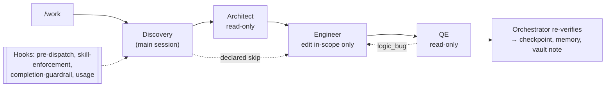

# Agentic Harness: Final Write-Up

## 1. Architecture

The harness runs as a single slash command, `/work`, whose orchestrator is the **main session**
(`.claude/skills/work/SKILL.md`), not a subagent, because subagents cannot dispatch nested
subagents. The orchestrator runs **Discovery** itself: it loads `memory/lessons-learned.md` and
`memory/facts.jsonl`, consults the Obsidian vault, and writes a schema-validated `scope.json`
with a task graph. It may refuse the work, or declare `research_skip_reason` so that Research is
skipped. Implementation and Verification are never skipped. It then dispatches three subagents
whose permissions are set by their tool allowlists, not by their prompts. The **Architect**
(Research) has `Read, Grep, Glob` plus two read-only Obsidian MCP tools, and returns
`findings.json` in which every claim is labelled Found, Not Found or Inferred and carries a
`file:line` citation. The **Engineer** (Implementation) has `Read, Grep, Glob, Edit, Write`
only. It re-verifies the cited findings, reads the `code-craftsmanship` skill before its first
edit, writes a failing test first, and may edit only exact `in_scope` paths. The **Quality
Engineer** (Verification) has `Read, Grep, Glob` only: it cannot run or edit anything itself. It
asks for narrow test commands, which the orchestrator runs through the forked `test-runner`
skill. It classifies every failure as `logic_bug`, `infrastructure_flake` or `environment`. A
logic bug goes back to the same Engineer for one repair. A flake is retried with the identical
command, after an orchestrator-enforced 2 s / 4 s backoff, with at most three executions in
total.

Agents never hand work to each other directly. Every artifact is retained, validated against
`harness/schemas/` and promoted by a deterministic Python bridge
(`harness/orchestrator/live_cli.py`) before the next phase sees it. The orchestrator then
re-runs its own `ORCH-*` commands before it reports success. Skills live in `.claude/skills/`
(`work`, `github`, `jira`, `obsidian`, `test-runner`, `code-craftsmanship`). Four hooks,
registered from `${CLAUDE_PROJECT_DIR}` in `.claude/settings.json`, enforce rules that agents
might forget:

- `pre_dispatch_check.py` refuses an Agent dispatch whose required upstream artifact is
  missing.
- `skill_enforcement.py` blocks hand-rolled Bash calls that bypass a skill.
- `completion_guardrail.py` (`Stop`) blocks "done" when verification evidence is missing or
  contradicts the claim.
- `record_agent_usage.py` captures per-agent token usage for cost accounting. The cost of one
  full run (`runs/run-20260929-costproof-001`) was **$9.5721282**.

`checkpoint.json` lets `/work --resume <run_id>` revalidate the completed phases and restart
only the phase that was interrupted. The memory files are a cross-run corpus, to which each run
appends at most five lessons. The full diagram and legend are in `docs/architecture.md`. A
compact view:

## 2. MCP vs REST: the Jira decision

Jira is the connector built both ways. **Route B, REST** (`harness/orchestrator/jira_connector.py`,
`GET /rest/api/3/issue/{key}`) is the production route that ticket-mode `/work` uses. **Route A,
MCP** (`harness/mcp/jira_server.py`, registered in `.mcp.json` and driven by `mcp_client.py`) is
a real JSON-RPC stdio server that exposes one read-only tool, `get_issue`, which calls the same
resolver. `connector_router.py` chooses between them deterministically. Under the default
`rest_first` policy:

- An authoritative REST answer (`resolved`, `not_found`, `unauthorized`, `identity_mismatch`) is
  final.
- `connector_unavailable` runs MCP only to corroborate.
- A transport-class `invalid_response` falls back to MCP.
- A fallback may never mask an authorization failure or accept a different ticket key.

`mcp_first` is the mirror image. Every routing decision is retained as
`runs/<run_id>/jira/routing/route-<n>.json`, recording the primary route, whether fallback ran
and why, and the final route. No credentials or raw HTTP bodies are written to it.

Mutations are handled differently on purpose. `create-ticket` and `edit-ticket` are **REST-only
with no fallback** (`connector_router.select_mutation_route`). A Jira write is not idempotent. If
a REST call times out, the issue may already have been created, and retrying over MCP could
create a duplicate. MCP's timeout and retry behavior gives no reliable way to tell "never
applied" from "applied but unacknowledged". Exposing a write tool on the MCP server would also
let an agent call `mcp__jira__*` directly. That would bypass `live_cli.py`'s explicit
authorization check (`authorized: true` plus an `authorization_source`, checked before any
validation or network call) and its evidence retention. Every mutation is re-read to confirm
identity, and a 5xx response becomes `indeterminate` instead of being retried.

REST was kept because it has fewer moving parts and needs no `.mcp.json` approval or subprocess
health check. Each call leaves one retained request/response pair, so a failure is easy to debug.
Both routes reach the same endpoint and run the same identity check, so neither has more
authority than the other. The evidence is honest about its limits.
`runs/run-20260909-connectorroute-001/CONNECTOR-ROUTE-PROOF.md` shows that both transports
really ran: a real MCP subprocess completed the handshake and `tools/call`, and both policies
classified the outcome correctly. However, **no Jira credentials were available**, so both routes
correctly reported `connector_unavailable`. The resolved-ticket path, create and edit are proven
only by deterministic tests (`tests/test_orchestrator_jira_connector.py`,
`test_orchestrator_connector_router.py`). No live Jira ticket was ever read or changed. For the
other connectors, the Architect reads Obsidian through MCP because a read-only tool grant is the
least-privilege boundary there, while write-back stays in the orchestrator's Python bridge.
GitHub push verification uses plain `git ls-remote`.

## 3. A surprising agent behavior and the guardrail it produced

In `runs/run-20261001-midimplresume-001`, Discovery wrote `in_scope` entries with annotations,
for example `demo-repo/src/loanflow/risk_bands.py (classify_credit_score only)`. `validate_scope`
accepted them, because the schema only required strings. The Architect completed Research.
Then the live Engineer returned `status: "blocked"` before touching any file. `engineer.md`
Step 1d requires the target path to match an `in_scope` entry character for character, and
`risk_bands.py` is not the same string as `risk_bands.py (classify_credit_score only)`. Its
`blocked_reason` asked for the scope to be re-issued with bare paths and the restriction moved
into `constraints`.

This was surprising for two reasons. First, the gap sat between two of my own contracts: the
validator I trusted had approved a scope that the downstream agent could not legally carry out.
Second, the rule had not been enforced consistently. `run-20260929-costproof-001` used the same
annotated style, and its Engineer edited anyway.

The Engineer that blocked was correct. If it had interpreted the annotation as "this file,
roughly", it would have widened its own write permission from free-form text, which is exactly
the kind of silent scope creep that least privilege exists to prevent. A promoted `scope.json`
cannot be changed during the run, so the honest outcome was a blocked run, not a quiet
workaround.

The guardrail moved the check to the earliest point where it can be made. `harness/evidence.py`
now rejects any `in_scope` entry that contains whitespace or an annotation, with a message
telling the author to put restrictions into `constraints` or `out_of_scope`. It is
regression-tested by `tests/test_artifact_contracts.py::test_scope_annotated_in_scope_entry_is_caught`.
The run also recorded the lesson `L-20261001-INSCOPE-BARE-PATHS`. The very next run,
`run-20261001-midimplresume-002`, loaded that lesson (`memory_refs_used`), wrote bare paths and
passed. The episode shows the harness's principles in practice. The orchestrator did not take
"scope approved" on trust, and the Engineer did not report success it could not achieve. The
retained blocked report was the evidence that led to the fix. A Discovery mistake that used to
cost a whole run at Implementation is now caught at scope validation.

## 4. What was deleted before submission, and why

Cleanup followed "cut noise, preserve evidence". Anything that serves as evidence for a claim
in `docs/assignment-audit.md` or this write-up was kept, including failed runs that taught
something. Only accidental or scratch material that no retained evidence depends on was
removed.

**Retained on purpose:**

- all acceptance evidence: every run directory cited in the audit or this write-up, the boundary
  tests, the permission-verification docs and `memory/`;
- successful runs and useful failed runs, including the blocked and inconclusive ones
  (`midimplresume-001`, `obsidianlive-003`), because the failures are part of the story;
- the two tracked usage files (`runs/_unmatched_usage/a0afd1446050e7213-20260814T175832Z.json.reconciled`
  and `runs/_usage_corroboration/a0afd1446050e7213.json`) that a retained run's usage
  reconciliation depends on;
- `runs/run-20260929-percentage-001/`. It is a genuine failed Engineer transport-contract
  incident and is small (54 files, about 0.10 MB). The committed `run-20260929-costproof-001`
  evidence and the committed lesson `L-20260929-EXPLICIT-CONTRACT-REMINDER-PER-TURN` cite it as
  the before-case. Deleting it would have left those references pointing at nothing, so it is
  kept as historical evidence and committed with this submission.

**Before submission, I removed:**

- accidental Obsidian `.obsidian/` metadata directories created inside the repository (repo
  root and `runs/`) and under historical run directories;
- untracked scratch and corroboration leftovers under `runs/_unmatched_usage/` and
  `runs/_usage_corroboration/` that no retained evidence references;
- the abandoned `runs/run-20260929-percentage-002/`, which stopped mid-Research and produced no
  result. Retained evidence mentions it only by name (for example, `costproof-001`'s session
  result lists it as abandoned context); nothing depends on its contents.

I also reverted, rather than committed, two stale uncommitted September memory additions (a fact
and a lesson in `memory/`). Every removed item was untracked or uncommitted, so no committed
history was rewritten.
